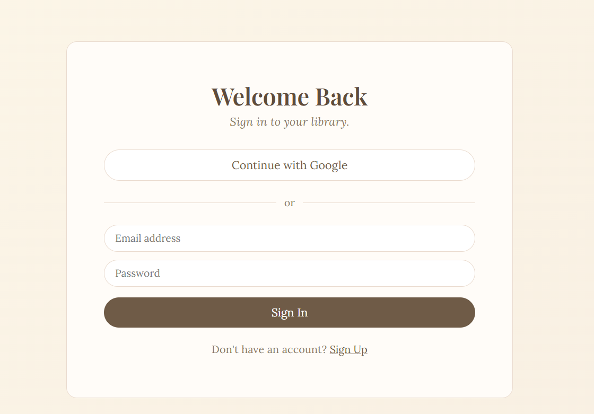
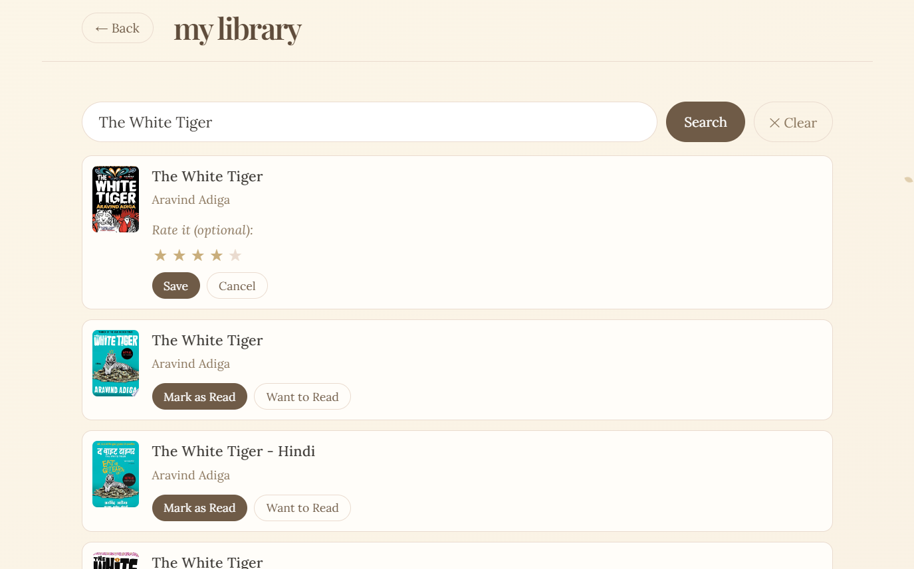
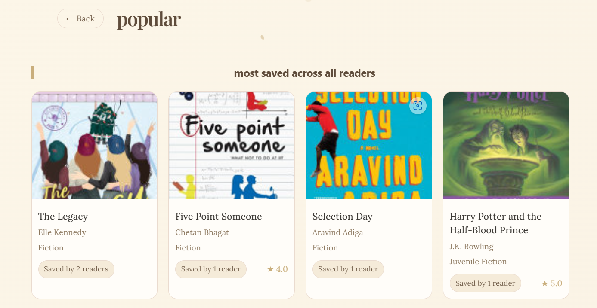
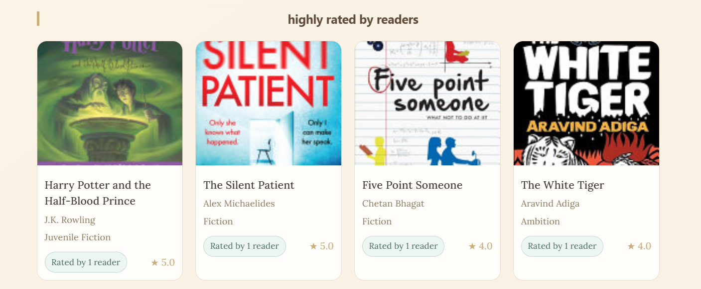
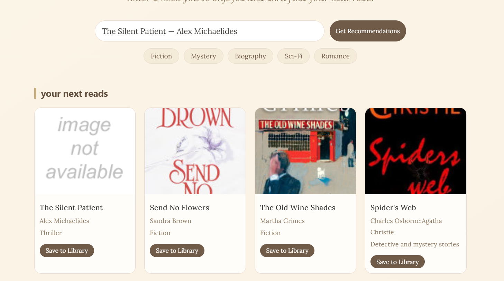
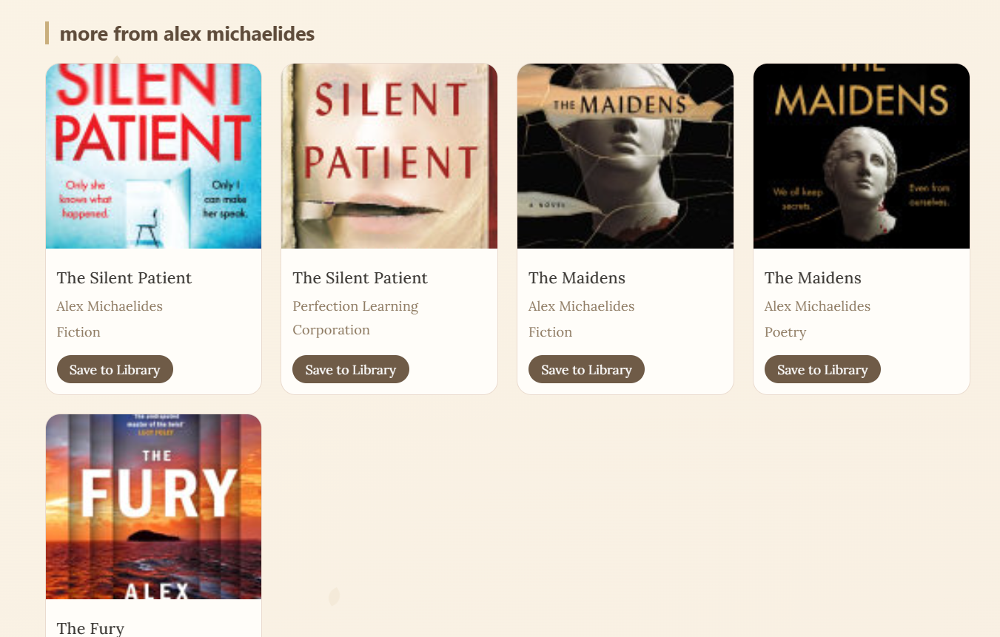

# What's Next? 📚

> **An AI-powered book recommendation web app**

[](https://whats-next-three-delta.vercel.app)

---

What's Next? is a personalized book recommendation app that learns from your reading history. Log the books you've read, rate them, and get tailored suggestions powered by TF-IDF content-based filtering — with Google Books as a fallback for any title outside the dataset. Discover what the broader community is reading through the Popular page, and find your next great read through the What's Next tab.

---

## 📸 Screenshots








---

## ✨ Features

- 🧠 **TF-IDF content-based filtering** for personalized recommendations
- 🔍 **Google Books API fallback** for books outside the local dataset
- 🔐 **Firebase authentication** — Google Sign-In and Email/Password
- 📚 **Personal library** with Read and Want to Read shelves
- ⭐ **Star ratings** for books you've read
- 💡 **What's Next tab** — recommendations based on your reading history
- 🌟 **Popular page** — most saved and highest rated books across all users
- 🔎 **Autocomplete search** with local dataset + Google Books fallback
- 🌿 **Fantasy-themed UI** with animated vines and floating petals

---

## 🛠️ Tech Stack

| Layer      | Technology                              | Hosting  |
|------------|-----------------------------------------|----------|
| Frontend   | React (Vite)                            | Vercel   |
| Backend    | FastAPI (Python)                        | Render   |
| Database   | Firebase Firestore (Python Admin SDK)   | Firebase |
| ML         | TF-IDF content filtering (scikit-learn) | —        |
| APIs       | Google Books API, Firebase Auth         | —        |
| Deployment | Vercel (frontend), Render (backend)     | —        |

---

## 🚀 Getting Started

### Prerequisites

- Node.js 18+
- Python 3.10+
- A Firebase project with Firestore and Authentication enabled
- A Google Books API key

### 1. Clone the repo

```bash
git clone https://github.com/GrandhiAnanya/whats-next.git
cd whats-next
```

### 2. Frontend setup

```bash
cd frontend
npm install
npm run dev
```

The app runs at `http://localhost:5173`.

### 3. Backend setup

```bash
cd backend
pip install -r requirements.txt
python -m uvicorn main:app --reload
```

The API runs at `http://localhost:8000`.

### 4. Environment variables

**`frontend/.env`**
```env
VITE_GOOGLE_BOOKS_API_KEY=your_google_books_api_key
VITE_API_URL=http://localhost:8000
VITE_FIREBASE_API_KEY=your_firebase_api_key
VITE_FIREBASE_AUTH_DOMAIN=your_project.firebaseapp.com
VITE_FIREBASE_PROJECT_ID=your_project_id
VITE_FIREBASE_STORAGE_BUCKET=your_project.appspot.com
VITE_FIREBASE_MESSAGING_SENDER_ID=your_sender_id
VITE_FIREBASE_APP_ID=your_app_id
```

**`backend/.env`**
```env
GOOGLE_BOOKS_API_KEY=your_google_books_api_key
```

> ⚠️ Never commit `.env` files. For production, set these as environment variables in your Vercel and Render dashboards.

---

## 📁 Project Structure

```
whats-next/
├── frontend/               # React app (Vite)
│   └── src/
│       ├── App.jsx         # Main search + recommendations UI
│       ├── Auth.jsx        # Sign-in / sign-up page
│       ├── Library.jsx     # Personal book library
│       ├── WhatsNext.jsx   # Per-book recommendation carousels
│       ├── Popular.jsx     # Most saved + highly rated across users
│       └── Profile.jsx     # User profile page
├── backend/                # FastAPI app + ML logic
│   ├── main.py             # API routes
│   ├── recommender.py      # TF-IDF model + search logic
│   └── requirements.txt
└── data/                   # Dataset + preprocessing scripts
    └── books_cleaned.csv   # Cleaned Kaggle books dataset (not committed)
```

---

## ⚙️ How It Works

### TF-IDF Recommendations

The backend loads a cleaned Kaggle books dataset and builds a TF-IDF matrix over each book's title, authors, categories, and description. When a user searches for a book, `get_recommendations()` looks up the title directly in the dataset and returns the most similar books by cosine similarity.

### Google Books Fallback

If a title isn't found in the local dataset, the backend fetches its description from the Google Books API and runs that description through the same TF-IDF matrix using `transform()` — finding dataset books with similar themes without needing an exact match.

### Firebase Auth Flow

Authentication is handled entirely by Firebase on the frontend. Users sign in with Google or Email/Password, and the Firebase `user.uid` is used as the Firestore document key for each user's library. No user credentials ever touch the backend.

---

## ⚠️ Dataset Limitations

The TF-IDF model is only as good as the dataset it's trained on. The current dataset covers a broad but finite selection of books — very new releases, niche titles, or self-published books may not be present. In those cases, the app falls back to the Google Books API to find semantically similar recommendations from the dataset, so you'll always get a result, even if it's less precise.

---

## 📄 License

This project is open source and available under the [MIT License](LICENSE).
